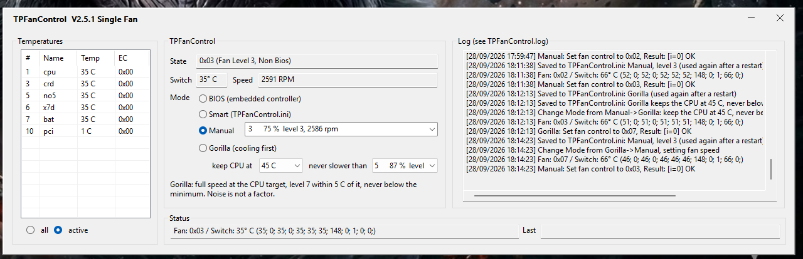
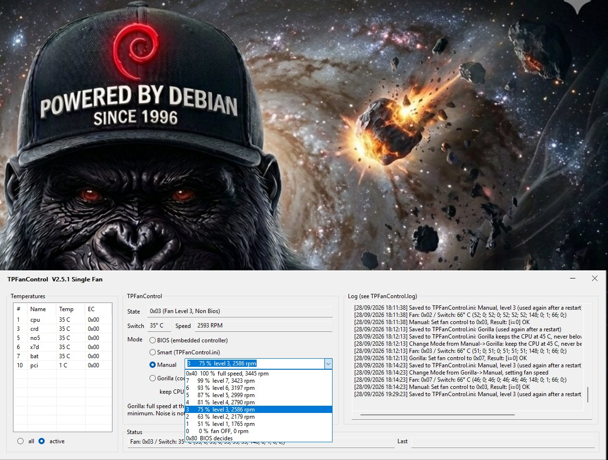

# TPFanCtrl2

Fan control for ThinkPads running Windows 10/11.

## This fork: Gorilla TPFanControl

A fork of [mews-se/TPFanCtrl2](https://github.com/mews-se/TPFanCtrl2) that
changes the window and the packaging, and adds one mode. **BIOS, Smart and
Manual work exactly as upstream.**



*The window (Windows, 2.5.1-gorilla.2): every sensor in one list, the fan at
level 3 (2,591 rpm), the four modes including Gorilla, and the log.*



*The Manual list, with the fan's speeds measured on this laptop: each level is
shown as its real share of full speed, from 0x40 (100 %, 3,445 rpm) down to 1
(51 %, 1,765 rpm) and 0 (fan off). The fan chip takes only these levels, so
these are the choices that exist.*

- **Gorilla mode (cooling first).** A fourth mode for people who want the
  laptop cool and do not mind the noise. You pick a CPU temperature to keep
  (40, 45 or 50 C) and a minimum speed. At the target and above the fan runs
  at full speed, within 5 C below it at level 7, and otherwise at the
  minimum; it never goes slower than the minimum. It steers by the CPU
  sensor, not the hottest sensor, because some ThinkPads report a sensor
  that sits at a fixed value whatever the fan does. Above `ManModeExit`
  (78 C by default) it runs at full speed whatever the settings. Settings:
  `Active=4`, `GorillaTarget=`, `GorillaFloor=`.
- **Levels shown as % and rpm.** The ThinkPad fan chip only takes levels
  0-7 and "full speed", so there is no free percentage setting. Instead,
  if you measure your fan once and put the 9 numbers in `FanLevelRpm=`,
  the level lists show each level as a percentage of full speed with its
  rpm, e.g. `4  81 %  level 4, 2790 rpm`. Without them the lists show plain
  levels. The numbers are only labels; they never change what is sent.
- **Runs as a Windows service.** The installer now sets the fan control up
  as upstream's `TPFanControl` service: it starts at boot as SYSTEM, before
  anyone signs in, and needs no prompt. The window is a remote control for
  it, runs without administrator rights, and starts at every sign-in.
  Upgrading from gorilla.1 replaces its sign-in task with the service.
- **A readable temperature list.** The list was smaller than its own
  columns, so it scrolled both ways and showed about half the sensors. It
  now shows every sensor and all four columns, and the columns scale with
  display scaling. It no longer flickers or jumps back to the top.
- **A normal title bar.** Minimise goes to the taskbar; close hides to the
  tray while the fan control keeps running. The minimise button lights up
  bright blue on hover (`CaptionHoverColor=RRGGBB` in the ini).
- **A manual level that survives a restart.** A mode or level picked by
  hand is written back to `TPFanControl.ini`. The automatic revert to Smart
  at `ManModeExit` is not saved.
- **A safer default.** `ManFanSpeed=4` instead of `0`, which switched the
  fan off when Manual was clicked.
- **An installer and a portable zip**, with the PawnIO driver bundled. The
  installer refuses anything that is not a Lenovo ThinkPad on 64-bit
  Intel/AMD Windows 10 (1809 or newer) or 11, installs the service, and
  on uninstall hands the fan back to the BIOS.

- **A Linux version** (`linux/`, 0.1.0, pre-release): the same four modes and
  the same window, as a systemd service using the kernel's `thinkpad_acpi`
  driver, packaged as `.deb` and `.rpm`. See [linux/README.md](linux/README.md).

What was done and why, in plain language and for developers, for both
versions: [docs/](docs/README.md).

Downloads are under [Releases](../../releases). Build the installer with
Inno Setup 6: `ISCC installer\GorillaTPFanControl.iss`; the portable zip
with `installer\build-portable.ps1`.

This repository carries on FanDjango's TPFanCtrl2 line, which was archived
in August 2026. The full history is preserved here — every branch and tag,
and the release binaries from V2.3.4 through V2.3.23 mirrored under
[Releases](../../releases).

## Lineage

troubadix's TPFanControl (thinkwiki.de) → [ThinkPad-Forum/TPFanControl](https://github.com/ThinkPad-Forum/TPFanControl)
→ [byrnes' dual-fan mod](https://github.com/byrnes/TPFanControl)
→ [Shuzhengz/TPFanCtrl2](https://github.com/Shuzhengz/TPFanCtrl2)
→ [FanDjango/TPFanCtrl2](https://github.com/FanDjango/TPFanCtrl2) (archived)
→ this repository. Public domain all the way through.

## How it works

One executable, two roles:

- The **engine** owns the embedded controller and drives the fan from a
  configurable temperature curve. It runs either as a plain window or as
  the `TPFanControl` Windows service, which controls the fan from boot as
  SYSTEM with no window.
- The **tray window** is a client of the engine. With the service running
  it needs no rights at all: it draws the state the engine publishes,
  mirrors the engine's log and hands over mode changes.

## Changes since FanDjango V2.3.23

- Fixed a crash that killed a tray client on its first data cycle
  (uninitialized sensor name pointers in the client path).
- The engine log is mirrored into client windows, timestamps intact,
  including a backlog of recent lines when the window starts.
- The tray menu no longer competes with the engine for the EC mutex;
  the hardware toggles are grayed out in a client.
- `ErraticSensorGuard` quarantines sensors that swing tens of degrees
  back and forth between cycles — multiplexed EC registers on newer
  machines that hold no temperature.
- `LidSmartLevel` runs a second smart profile while the lid is closed,
  for machines that work docked.
- The EC is reached through [PawnIO](https://pawnio.eu), so fan control
  works with memory integrity (HVCI) enabled. TVicPort remains as a
  fallback, loaded dynamically only when needed.
- **Start with Windows** manages a Startup folder shortcut instead of a
  run key entry, which Windows 11 was seen silently skipping at logon.

## Requirements

The EC is reached through one of two port drivers, tried in this order
(override with `PortBackend=` in the ini):

- **PawnIO** — install it from [pawnio.eu](https://pawnio.eu) or
  `winget install namazso.PawnIO`, and keep `LpcACPIEC.bin` (bundled
  here under `fancontrol/pawnio/`, part of the release zip) next to the
  exe. The driver is WHQL-signed and works with memory integrity (HVCI)
  enabled — this is the right choice on any current Windows 11 machine,
  where TVicPort's driver is refused. The signed module reaches the EC
  through the classic ports 0x62/0x66.
- **TVicPort** — put `TVicPort.dll` next to the exe with its kernel
  driver (`TVicPort64.sys` in `System32\drivers`) in place. Both ship
  with the original TPFanControl installer from the SourceForge days;
  uninstalling that program removes them again, so keep your own
  copies. Only works with memory integrity off, and it is the only
  backend that reaches the `UseTWR` sensor interface.

## Install

1. Put `TPFanControl.exe`, `TPFanControl.ini` and `LpcACPIEC.bin` (or
   `TVicPort.dll`) in a folder of their own, e.g.
   `C:\Program Files\TPFanCtrl2`.
2. Run the exe as administrator once and enable **Start with Windows** in
   the tray menu. That installs the service and puts a shortcut in your
   Startup folder that brings up the tray window at logon, without
   elevation prompts. The same from a prompt: `TPFanControl.exe -i` as
   administrator. Up to 2.5.0 the toggle wrote a run key entry instead,
   which Windows 11 was seen silently skipping at logon — flipping the
   toggle in either direction also cleans up such a leftover entry.
3. Adjust `TPFanControl.ini` next to the exe. The ones that matter most:
   - `Level=temp fan hystUp hystDown` — the fan curve, one line per step
   - `IgnoreSensors=` — sensors that should not drive the fan
   - `SingleFan=1` — on machines with one fan
   - `PowerSuspendMode=2` — keep controlling the fan with the lid closed,
     for docked use; the default hands the fan to the BIOS on lid close

To uninstall, disable **Start with Windows** in the menu (or run
`TPFanControl.exe -u` as administrator) and delete the folder.

## Building

Visual Studio Build Tools with the C++ workload, toolset v145. From a
developer prompt:

```
msbuild fancontrol\fancontrol.sln /p:Configuration=Release /p:Platform=Win32
```

The icon helper projects under `TPFCIcon` and `TPFCIcon_noballons` still
name the v143 toolset; add `/p:PlatformToolset=v145` when building them
with current tools.

## Tested hardware

ThinkPad X13 Gen 3 (21BN, single fan) runs the service + tray setup as
its daily driver. For models confirmed on earlier versions, see the
[upstream README](https://github.com/Shuzhengz/TPFanCtrl2#readme).

## License

Public domain (Unlicense), inherited from upstream. No warranty — this
program writes to your embedded controller, use it at your own risk.
